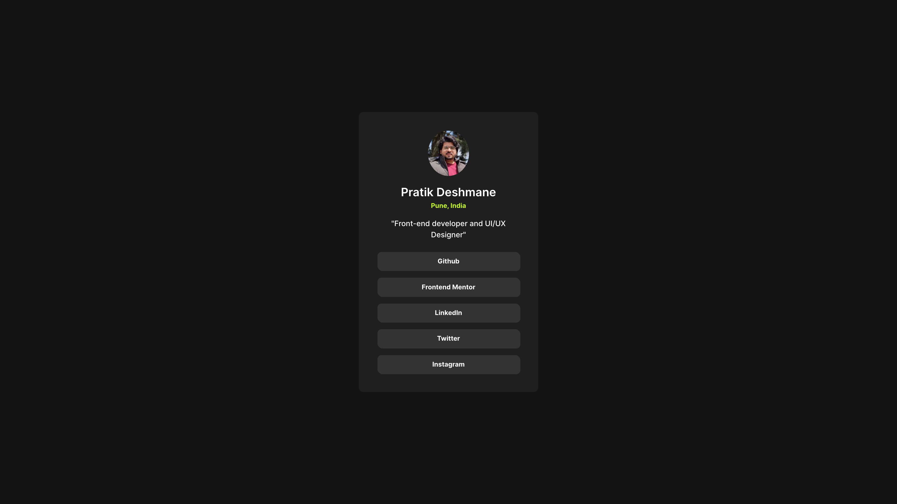

# Frontend Mentor - Social media links profile Challenge

This is a solution to the [Social links profile](https://www.frontendmentor.io/challenges/social-links-profile-UG32l9m6dQ). Frontend Mentor challenges help you improve your coding skills by building realistic projects.

## 🔗 Live Site

👉 [View Live Demo](https://social-links-profile-eight-psi.vercel.app/)

## 📸 Screenshot

## 💻 Built With

- Semantic HTML5
- CSS custom properties (variables)
- Flexbox
- Mobile-first workflow
- Hover effects
- CSS Grid
- [Frontend Mentor](https://www.frontendmentor.io) starter files

## 🚀 What I Learned

In this project, I practiced:

- Building a responsive card layout
- Using CSS variables for color themes
- Applying consistent spacing and typography
- Using grid and flexbox for the layout

## 📂 Folder Structure
├── index.html
├── style.css
├── images/
└── README.md

## ✍️ Author

- Frontend Mentor: [@Pratik7006](https://www.frontendmentor.io/profile/Pratik7006)
- GitHub: [@Pratik7006](https://github.com/Pratik7006)

## 🤝 Acknowledgments

Thanks to [Frontend Mentor](https://www.frontendmentor.io) for providing such helpful challenges!

